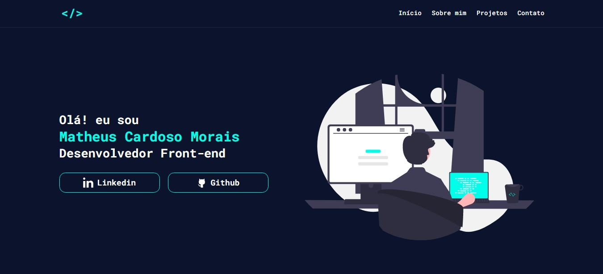

<h1 align="center">Meu Portifólio</h1>

### 🔗 Links

- URL do site no ar: [Clique aqui!](https://matheuscmorais356.github.io/Portfolio/)

### 🛠 Tecnologias

As seguintes ferramentas foram usadas na construção do projeto:

- HTML
- CSS
- JavaScript

### Autor
---

  
  <b>Matheus Cardoso Morais</b>

Feito por Matheus Cardoso 👋🏽 Entre em contato!

 

